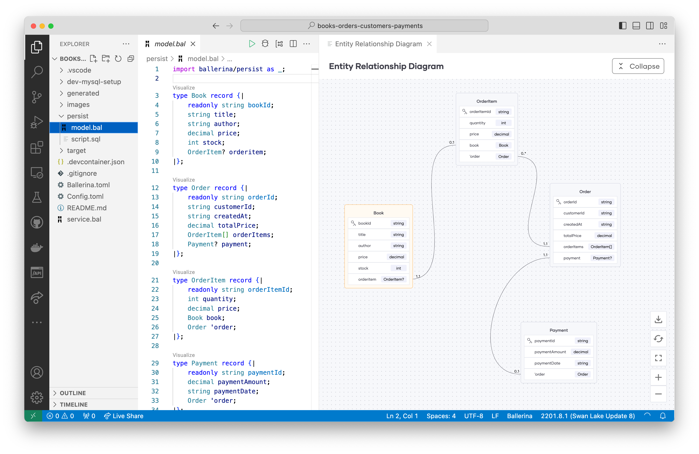
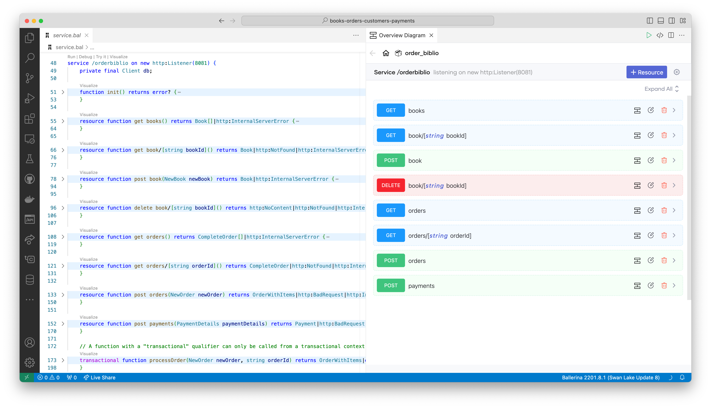

# OrderBiblio
In this directory, you'll find the backend API, crafted using Ballerina, as detailed in the tweet linked below. 
[https://twitter.com/RaulJuncoV/status/1713518999353327854?s=20](https://twitter.com/RaulJuncoV/status/1713518999353327854?s=20)

## Original handwritten description
```
Learning backend should be exciting, not exhausting!

Here is how

The Problem

I need a system to manage books, customers, orders, and payments.

Only authenticated users can make orders.

The Database Design

Books: BookID (PK), Title, Author, Price, Stock

Customers: CustomerID (PK), Name, Email, PasswordHash, IsAdmin

Orders: OrderID (PK), CustomerID (FK), CreatedAt, TotalPrice

OrderItems: OrderItemID (PK), OrderID (FK), BookID (FK), Quantity, Price

Payments: PaymentID (PK), OrderID (FK), PaymentAmount, PaymentDate

A Customer can have many Orders.
An Order can have many OrderItems.
An Order has one Payment.
An OrderItem refers to one Book.

Connect to the DB

Use an ORM like Entity Framework or Hibernate to map your entities to the database tables.

This will handle the database connections and allow you to work with objects in your code.

Add API Endpoints

GET /books: Retrieve all books.

POST /books: Add a new book (Admin only).

DELETE /books/{bookId}: Delete a book by ID (Admin only).

GET /orders: Retrieve all orders (Admin only).

POST /orders: Create a new order.

GET /orders/{orderId}: Retrieve a specific order.

POST /payments: Process a payment for an order.

Authentication

Use JWT (JSON Web Tokens) to handle user authentication.

Users will log in, receive a token, and use that token for the next requests.

Logging

Configure Serilog to capture and store log entries for monitoring and debugging purposes.

Testing

Write unit tests and integration tests to verify that your endpoints are working.

Bonus point if you set a Postman collection to test your API.

What else?
``` 

## Data Model

This section presents the data model derived from the preceding description.

### Ballerina Records Representing Entities
Ballerina's [`bal persist`](https://ballerina.io/learn/bal-persist-overview/) provides functionality akin to ORM within the platform. It introduces a resource-centric API tailored for databases, which is constructed based on the entities defined in your data model. Ballerina record types enable you to define your entities and their interrelationships. Below, you'll find the comprehensive data model crafted for this demonstration.

```ballerina
type Book record {|
    readonly string bookId;          
    string title;
    string author;
    decimal price;     
    int stock;
	OrderItem? orderitem;
|};

type Order record {|
    readonly string orderId;
    string customerId;
    string createdAt;    
    decimal totalPrice;
	OrderItem[] orderItems;
	Payment? payment;
|};

type OrderItem record {|
    readonly string orderItemId;
    int quantity;
    decimal price;
    Book book;
    Order 'order;
|};

type Payment record {|
    readonly string paymentId;
    decimal paymentAmount;
    string paymentDate; 
    Order 'order;
|};
```

### ER diagram 
The ER diagram provided below is generated using the Ballerina VSCode extension. It serves as a visual representation of the aforementioned type definitions. This notion of "code as the picture and the picture as the code" emphasizes the bi-directional mapping between the code and its visual representation.



### MySQL as the datastore
In this sample, I've chosen MySQL as the datastore. Besides MySQL, `bal persist` also supports MSSQL, Google Sheets, and In-memory databases. Below is the DDL generated using the `bal persist generate` command for the previously discussed data model.

```sql
DROP TABLE IF EXISTS `Payment`;
DROP TABLE IF EXISTS `OrderItem`;
DROP TABLE IF EXISTS `Order`;
DROP TABLE IF EXISTS `Book`;

CREATE TABLE `Book` (
	`bookId` VARCHAR(191) NOT NULL,
	`title` VARCHAR(191) NOT NULL,
	`author` VARCHAR(191) NOT NULL,
	`price` DECIMAL(65,30) NOT NULL,
	`stock` INT NOT NULL,
	PRIMARY KEY(`bookId`)
);

CREATE TABLE `Order` (
	`orderId` VARCHAR(191) NOT NULL,
	`customerId` VARCHAR(191) NOT NULL,
	`createdAt` VARCHAR(191) NOT NULL,
	`totalPrice` DECIMAL(65,30) NOT NULL,
	PRIMARY KEY(`orderId`)
);

CREATE TABLE `OrderItem` (
	`orderItemId` VARCHAR(191) NOT NULL,
	`quantity` INT NOT NULL,
	`price` DECIMAL(65,30) NOT NULL,
	`orderitemBookId` VARCHAR(191) UNIQUE NOT NULL,
	FOREIGN KEY(`orderitemBookId`) REFERENCES `Book`(`bookId`),
	`orderOrderId` VARCHAR(191) NOT NULL,
	FOREIGN KEY(`orderOrderId`) REFERENCES `Order`(`orderId`),
	PRIMARY KEY(`orderItemId`)
);

CREATE TABLE `Payment` (
	`paymentId` VARCHAR(191) NOT NULL,
	`paymentAmount` DECIMAL(65,30) NOT NULL,
	`paymentDate` VARCHAR(191) NOT NULL,
	`paymentOrderId` VARCHAR(191) UNIQUE NOT NULL,
	FOREIGN KEY(`paymentOrderId`) REFERENCES `Order`(`orderId`),
	PRIMARY KEY(`paymentId`)
);

```

## Service Interface
Based on the original description, I developed an HTTP service using Ballerina. One of Ballerina's strengths lies in its cloud-native abstractions, such as services, resources, clients, and network interactions, which are seamlessly integrated into the language. These abstractions facilitate a refined and intuitive representation of service interfaces. Refer to the image below for a visual representation:

Here are key highlights:
- The Swagger-like visualization on the right is a direct representation of the code.
- Resource function signatures define the HTTP verb, path parameters, query parameters, input payload structure, response status codes, and response payload structure.




