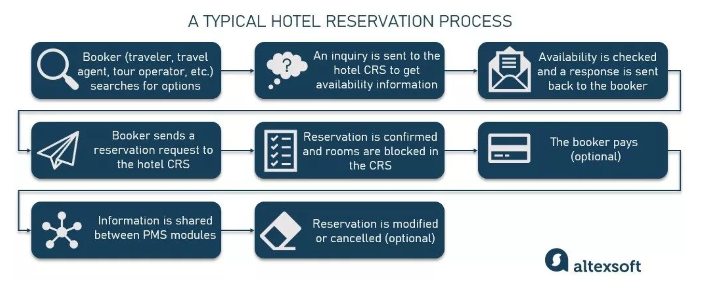
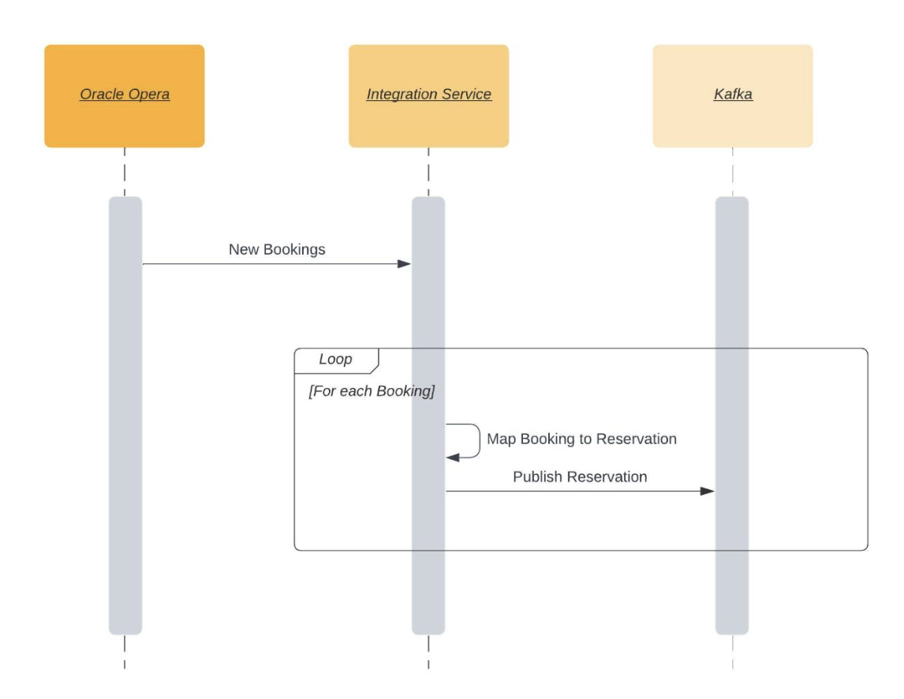

# Hotel Reservations to Kafka  
This sample demonstrates how to publish hotel reservation events to Kafak using Ballerina. It is showcases variable integration-related graphical tools available in the Ballerina platform. 

## Integration scenario
Following image describes the various stages of the hotel reservation process. 

This sample focuses only on sharing reservations with other PMS modules. The following sequence diagram describes the exact integration. 

## Integration tools in Ballerina platform

### JSON to Ballerina record generator

### Service designer 

### `Config.toml` generator

### Data mapper 

### Try it tool 
